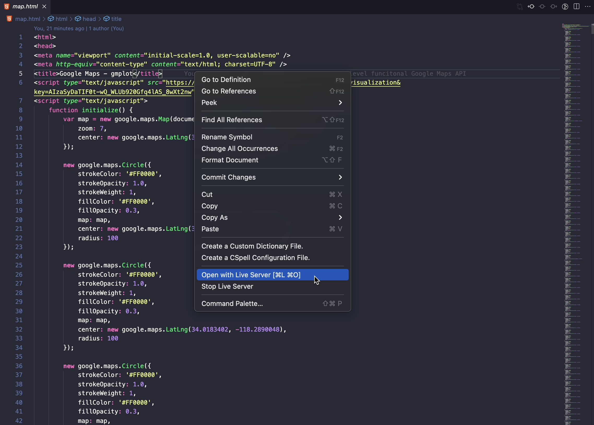

# google-maps-tourist

## Description
This project is intended to expand an option on the google maps "Directions" functionality to provide a more sight-seeing experience for integration on road trips for a more immersive UX. This project was written in Python, and I am currently working to expand it to a static *github.io pages* website with a Flask back-end React front-end. 
## Table of Contents
- [Installation](#installation)
- [Usage](#usage)
- [Credits](#credits)
- [License](#license)
## Installation
Two installations are needed to run this locally

In order to run *main.py* [Python Client for Google Maps Services](https://pypi.org/project/googlemaps/) needs to be locally installed
```
pip install -U googlemaps
```

To plot and export *.html* data [A matplotlib-like interface to plot data with Google Maps](https://pypi.org/project/gmplot/) needs to be installed
```
pip install gmplot
```


## Usage
Provide instructions and examples for use. Include screenshots as needed.
To add a screenshot, create an `assets/images` folder in your repository and upload your screenshot to it. Then, using the relative filepath, add it to your README using the following syntax:

If this is being ran locally, the results will be exported to *(root)/map.html*. To allow automatic refreshing use [Live-Server](https://github.com/ritwickdey/vscode-live-server) to open the *map.html* on a localhost that automatically updates every time the *main.py* is ran.


<br />

**Example:** From University of Southern California to Griffith Observatory, the localhost *map.html* will look something like this


---
## License
The last section of a high-quality README file is the license. This lets other developers know what they can and cannot do with your project. If you need help choosing a license, refer to [https://choosealicense.com/](https://choosealicense.com/).

## How to Contribute
If you created an application or package and would like other developers to contribute it, you can include guidelines for how to do so. The [Contributor Covenant](https://www.contributor-covenant.org/) is an industry standard, but you can always write your own if you'd prefer.
